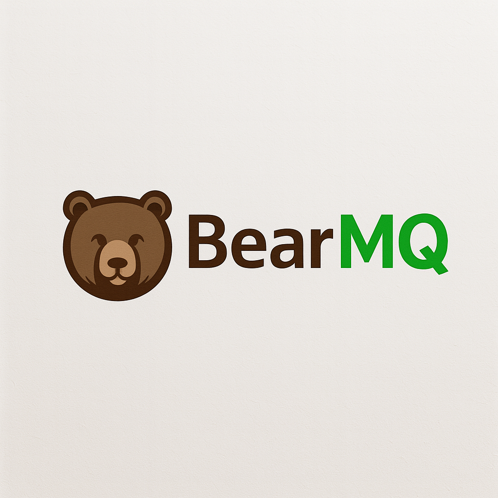
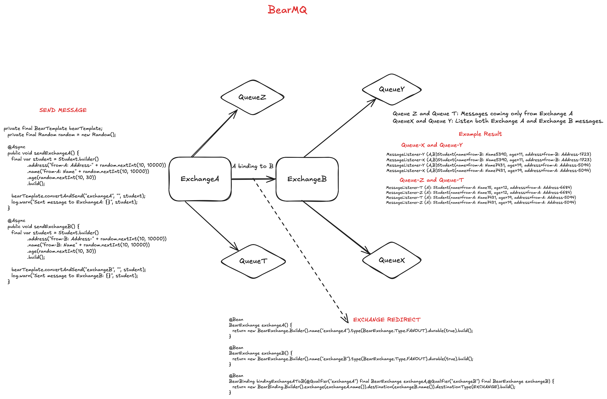

# BearMQ

<div align="center">
  

<em>A lightweight, distributed message queue system for modern architectures</em>

**Hobby Project for fun 🚀**


</div>

---

## 📋 Table of Contents

- [Overview](#-overview)
- [Getting Started](#-getting-started)
    - [Prerequisites](#-prerequisites)
    - [Installation](#-installation)
- [Features](#-features)
- [Configuration](#-configuration)
- [Roadmap](#-roadmap)
- [Example Usage](#example-usage)
- [Demo Architecture](#demo-architecture)
- [Video](#video)
- [License](#-license)
- [Support Me](#-support-my-work)

---

## ✨ Overview

BearMQ is a lightweight, distributed message queue system designed to enable reliable and scalable asynchronous
communication in modern architectures. Built for JVM environments, it simplifies deployment and integration, making it
easier to establish decoupled interactions across distributed services.

### Why BearMQ?

This project focuses on streamlining message-driven workflows with core features such as:

- 🧩 **Modular Architecture**: Supports exchanges, queues, and bindings to model complex messaging topologies
- 🚀 **Spring Boot Integration**: Provides configuration metadata and simple setup for Spring applications
- 🔄 **Reliable Message Delivery**: Includes retry mechanisms and custom exceptions for robustness
- 🛡️ **Multi-Tenant Support**: Manages virtual hosts and tenant lifecycle for scalable multi-tenant deployments
- 📊 **Monitoring & Metrics**: Exposes runtime metrics to track server health and message throughput

---

## 🔌 Features

| Component         | Details                                                                                                                                                                                          |
|:------------------|:-------------------------------------------------------------------------------------------------------------------------------------------------------------------------------------------------|
| **Architecture**  | • Distributed message broker with producer-consumer model<br>• Supports multiple queues<br>• Built on Java with Spring Boot                                                                      |
| **Code Quality**  | • Uses Lombok for boilerplate reduction<br>• Follows standard Maven project structure<br>• Includes configuration validation via `spring-configuration-metadata.json`                            |
| **Documentation** | • Provides `docker-compose.yml` for container setup<br>• Includes comprehensive README with setup instructions<br>• Configuration files (`application.yml`, `jvm.config`) documented             |
| **Integrations**  | • Spring Boot integration via `bearmq-spring-client`<br>• PostgreSQL support for persistence<br>• Uses Jackson for JSON serialization<br>• Supports Docker for containerization                  |
| **Modularity**    | • Modular Maven modules (`bearmq-spring-client`, `broker`, `demo`)<br>• Clear separation of core broker logic and client SDK                                                                     |
| **Performance**   | • Uses Chronicle Queue for high-performance message storage<br>• Asynchronous processing via Spring's `@Async`                                                                                   |
| **Security**      | • Basic security via Spring Security<br>• Configuration options for SSL/TLS in `application.yml`                                                                                                 |
| **Dependencies**  | • **Core**: `spring`, `spring-cloud-dependencies`, `spring-retry`<br>• **Messaging**: `chronicle-queue`, `ulid-creator`<br>• **Utilities**: `commons-codec`, `commons-lang3`, `jackson-databind` |

---

## 🚀 Getting Started

### 📋 Prerequisites

This project requires the following dependencies:

- **Programming Language**: Java 21
- **Package Manager**: Maven 3.8+
- **Container Runtime**: Docker (optional)

### ⚙️ Installation

Build BearMQ from source and install dependencies:

1. **Clone the repository**:
   ```bash
   git clone https://github.com/nuricanozturk01/bearmq
   ```

2. **Navigate to the project directory**:
   ```bash
   cd bearmq
   ```

3. **Install dependencies**:

   ```bash
   docker compose up -d
   ```
   ```bash
   cd bearmq-spring-client
   mvn install
   ```
   or add your **pom file**
   ```xml
    <repositories>
      .....
      <repository>
        <id>repsy</id>
        <name>My Private Maven Repository on Repsy</name>
        <url>https://repo.repsy.io/mvn/nuricanozturk/bearmq-spring-client</url>
      </repository>
      .....
    </repositories>

    <dependencies>
      .....
       <dependendency>
         <groupId>com.bearmq</groupId>
         <artifactId>bearmq-spring-client</artifactId>
         <version>0.0.1</version>
       </dependendency>
      .....
    </dependencies>

   ```

---

## ⚙️ Configuration

### JVM Options

**Add the following JVM options**

```bash
--add-opens=java.base/java.lang=ALL-UNNAMED 
--add-opens=java.base/java.lang.reflect=ALL-UNNAMED 
--add-opens=java.base/jdk.internal.misc=ALL-UNNAMED 
--add-opens=java.base/jdk.internal.ref=ALL-UNNAMED 
--add-opens=java.base/sun.nio.ch=ALL-UNNAMED 
--add-opens=java.base/java.io=ALL-UNNAMED 
--add-opens=java.base/java.nio=ALL-UNNAMED 
--add-exports=java.base/jdk.internal.misc=ALL-UNNAMED 
--add-exports=java.base/jdk.internal.ref=ALL-UNNAMED 
--add-exports=java.base/sun.nio.ch=ALL-UNNAMED
```

### Application Configuration

Configuration is managed through `application.yml` and includes settings for:

- Database connections
- Message queue parameters
- Security configurations
- Monitoring endpoints

---

## 📈 Roadmap

- [x] **Task 1**: ~~Implement MVP version~~
- [ ] **Task 2**: Implement Spring Security and JWT Token
- [ ] **Task 3**: Separate Broker Server, Metrics Server and REST API
- [ ] **Task 4**: Implement Metrics API
- [ ] **Task 5**: Design and Implement Admin Panel
- [ ] **Task 6**: Design and Implement SaaS Landing page and panel
- [ ] **Task 7**: Review and solve problems (e.g., handle empty queue exceptions properly)
- [ ] **Task 8**: Guarantee data integrity and prevent message loss
- [ ] **Task 9**: Implement Retry operations for critical components
- [ ] **Task 10**: Add comprehensive test coverage
- [ ] **Task 11**: Performance optimization and benchmarking

---

## Example Usage

- Firstly You should create tenant

```bash
curl --location 'http://localhost:3333/api/auth/register' \
--header 'Content-Type: application/json' \
--data-raw '{
    "full_name": "nuri",
    "username": "nuricanozturk",
    "email": "canozzturk309@gmail.com",
    "password": "Test123"
}'
```

- Then you should create vhost

**Note: you can take invalid token (not implemented yet)**

```bash
curl --location --request POST 'http://localhost:3333/api/broker/vhost' \
--header 'X-API-KEY: dmafvEHBVmmesVBudwtzZSbgCIBthBoRMyrARcRvaGFdOyssVqga' \
--header 'Authorization: Bearer token123' \
--data ''
```

**- Response should like below**

```
{
    "id": "01K3C3WPE87JQ4XNWHR2YM208E",
    "name": "nuricanozturk-yaiumxoup",
    "username": "awrbjvzwc",
    "password": "RkZMcGhTS2pN", -> BASE64!
    "domain": "xghqwinaj.localhost:6667",
    "url": "xghqwinaj.localhost:6667"
}
```

- Then you create producer and consumer apps (or all of them in single app)
    - application.yml should be below (retry part do not implemented yet)
  ```yml
  bearmq:
    username: awrbjvzwc
    password: RkZMcGhTS2pN
    host: localhost
    port: 6667
    virtual-host: nuricanozturk-yaiumxoup
    api-key: dmafvEHBVmmesVBudwtzZSbgCIBthBoRMyrARcRvaGFdOyssVqga
  ```
- your Main class should have @EnableBear** annotation
- You can create Queue and exchange and bind these.

### Minimal App (Exchange + 2 queue + listener)

**- Main.java**

```java

@SpringBootApplication
@EnableBear
public class BearmqConsumerApplication {

  public static void main(String[] args) {
    SpringApplication.run(BearmqConsumerApplication.class, args);
  }

}
```

**- BearConfig.java**

```java

@Bean
BearExchange exchangeA() {
  return new BearExchange.Builder()
          .name("exchangeA")
          .type(BearExchange.Type.FANOUT)
          .durable(true)
          .build();
}

@Bean
BearQueue queueX() {
  return new BearQueue.Builder().name("queueX").durable(true).build();
}

@Bean
BearBinding bindA(final BearQueue queueX) {
  return new BearBinding.Builder()
          .exchange("exchangeA")
          .destination(queueX.name())
          .destinationType(BearBinding.DestinationType.QUEUE)
          .build();
}

@Bean
BearQueue queueY() {
  return new BearQueue.Builder().name("queueY").durable(true).build();
}

@Bean
BearBinding bindB(final BearQueue queueY) {
  return new BearBinding.Builder()
          .exchange("exchangeA")
          .destination(queueY.name())
          .destinationType(BearBinding.DestinationType.QUEUE)
          .build();
}
```

- **MessageListener.java**

```java

@Service
public class MessageListener {
  @BearListener(queues = "queueX")
  public void listenQueueX(final Student test) {
    System.out.println("MessageListener-X " + test);
  }

  @BearListener(queues = "queueY")
  public void listenQueueY(final Student test) {
    System.out.println("MessageListener-Y " + test);
  }
}
```

---

## Demo Architecture



---

## Video

👉 Click image for watching video

[](https://www.youtube.com/watch?v=KRjMb-gj2uM)

---

## 📜 License

BearMQ is protected under the [MIT License](https://choosealicense.com/licenses/mit/). For more details, refer to
the [LICENSE](https://choosealicense.com/licenses/mit/) file.

---

## 🙏 Acknowledgments

Special thanks to all contributors who have helped make BearMQ possible. This project builds upon the excellent work of
the open-source community, particularly the Spring Framework and Chronicle Queue projects.

---

## ☕ Support My Work

If you find my projects helpful or want to support my open-source contributions:

<a href="https://www.buymeacoffee.com/canozturk3U" target="_blank">
  
</a>
